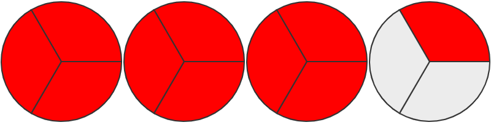

# FractionPainter

FractionPainter is a Javascript based tool that draws fractions using circles. It helps explain the meaning of *Fraction*.

License: [MIT License](./LICENSE)

## Getting started

Let's paint $\frac{10}{3}$ 🎨🖌️

1. Download [fractionpainter.js file](./fractionpainter.js) and include in your code
   
   ```html
   <script src="fractionpainter.js"></script>
   ```

2. Add the element where you want the fraction appear: a div or a span
   
   ```html
   <div id="fraction_container1"></div>
   ```

3. Call the `paint` method of the `fractionPainter` object: this takes the element [selector](https://www.w3schools.com/cssref/css_selectors.asp) as the first argument and the [options](#options) as the second argument.

   ```javascript
    fractionPainter.paint("#fraction_container1", {width: 800, height: 450, numerator: 10, denominator: 3});
   ```

and that's all (see [example.html](./example.html)):



## Options

FractionPainter has some options that can be passed when the method `paint` is called.

- `numerator` (default is 1)

- `denominator` (default is 2)

- `width` set the canvas width

- `height` set the canvas height
